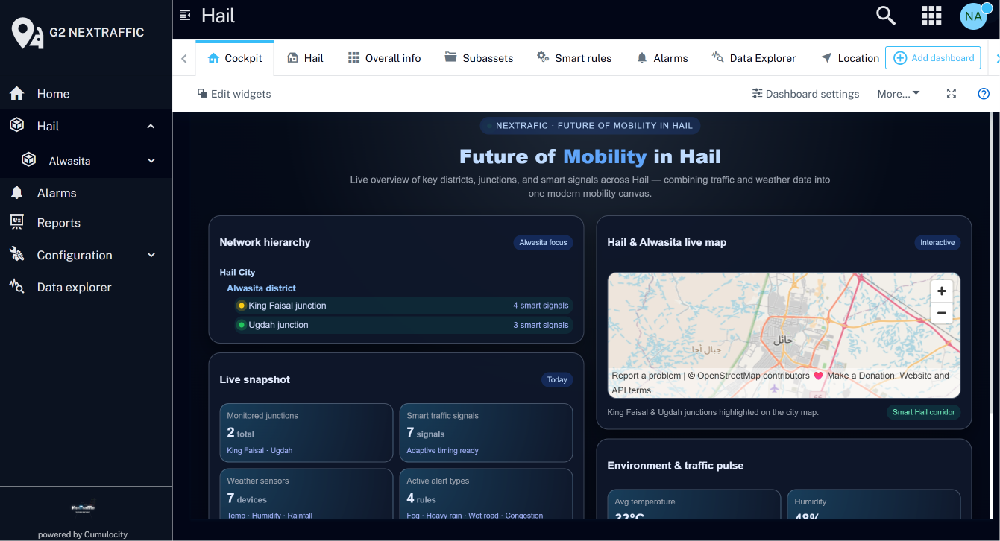
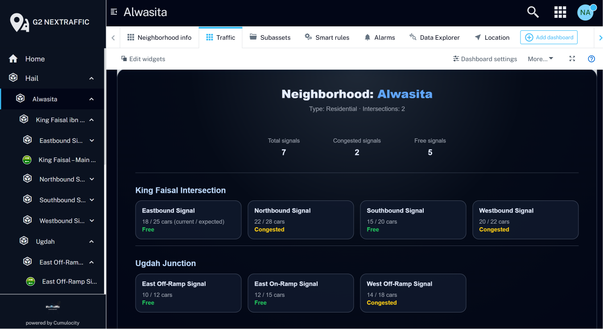
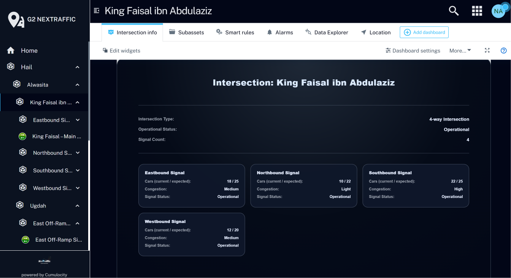
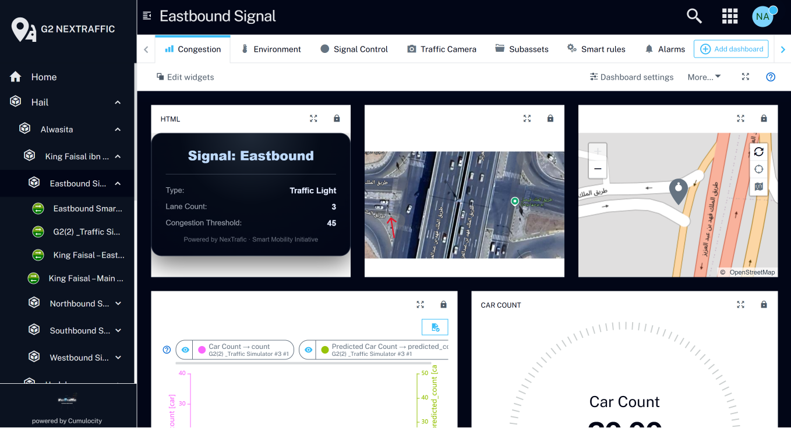
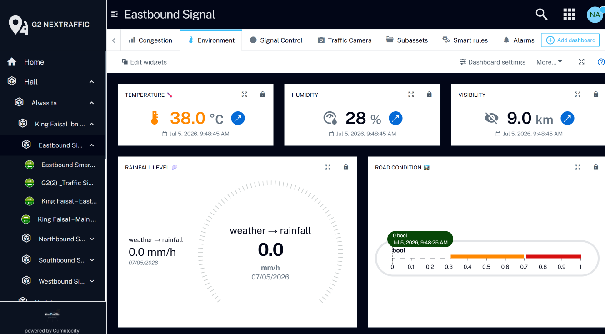
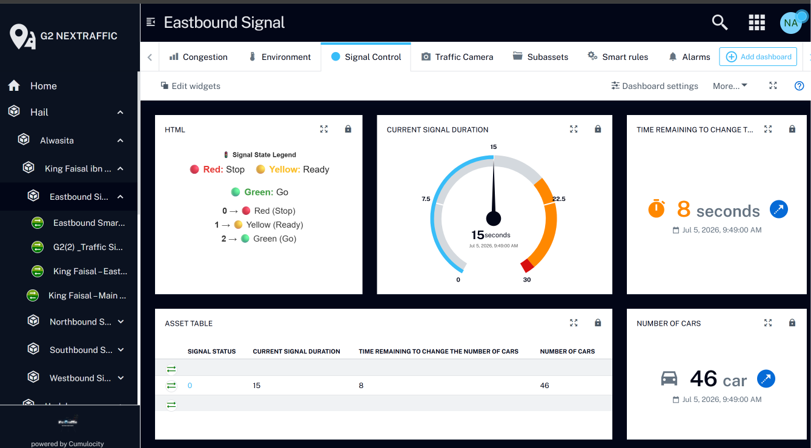
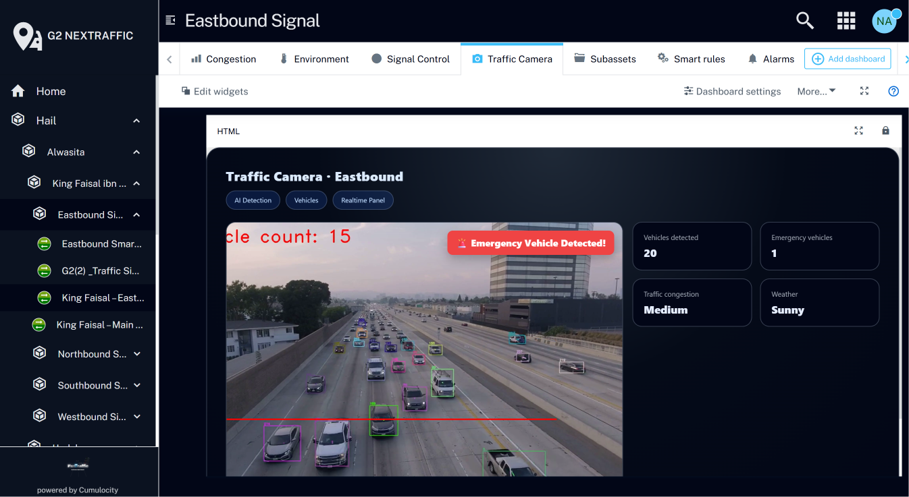

# NexTraffic – AI & IoT Smart Traffic Management System

NexTraffic is a smart traffic management project developed during the AI & IoT Bootcamp by the National Information Technology Academy (NITA). The project focuses on improving traffic flow by using IoT sensors, real-time monitoring, and an interactive Cumulocity dashboard to monitor intersections, traffic signals, and road conditions.

---

# Project Overview

Many cities experience repeated traffic congestion, especially during rush hours, large events, emergencies, and bad weather. Traditional traffic lights usually follow fixed timers and do not respond to real-time traffic flow, which increases waiting time, congestion, and fuel consumption.

NexTraffic addresses this challenge by proposing an intelligent traffic light system that uses sensors placed at intersections to monitor vehicle flow and support automatic signal timing decisions. The system also provides a dashboard for traffic authorities to view live traffic conditions, signal status, alerts, and environmental data.

---

# Screenshots

## Hail Smart Mobility Overview

## Neighborhood Traffic Overview

## Intersection Details

## Signal Congestion Dashboard

## Environment Metrics

## Signal Control Dashboard

## Traffic Camera and Emergency Detection

---

# Repository Note

This repository presents the project overview, dashboard screenshots, features, and system concept. The source code is not included because the project was developed as a bootcamp dashboard and IoT prototype using Cumulocity.

---

# Key Features

- Smart traffic monitoring dashboard.
- Real-time intersection and signal monitoring.
- IoT-based traffic signal representation.
- Vehicle count monitoring.
- Weather-related data display such as temperature, wind, and visibility.
- Alerts and alarms for traffic-related events.
- Map-based visualization of intersections.
- Signal status and timing overview.
- Dashboard support for traffic management and decision-making.

---

# Dashboard Components

The Cumulocity dashboard includes:

- Smart mobility home dashboard.
- Map view for monitored intersections.
- Traffic signal devices and groups.
- Car count widgets.
- Signal timing widgets.
- Weather and visibility measurements.
- Alarm and alert monitoring.
- Intersection hierarchy for city, district, junctions, and signals.

---

# System Concept

The system is designed around a smart city traffic structure:

1. **City Level**  
   Represents the monitored city area, such as Hail.

2. **District Level**  
   Represents the selected district or traffic zone.

3. **Intersection Level**  
   Represents monitored junctions and intersections.

4. **Signal Level**  
   Represents traffic signal directions such as eastbound, southbound, west off-ramp, and east off-ramp.

5. **Dashboard Level**  
   Displays live traffic data, signal status, weather conditions, and alerts for traffic authorities.

---

# Added Value

- Improves traffic flow and reduces waiting time.
- Supports emergency response by prioritizing emergency vehicles.
- Enables real-time interaction between sensors and traffic signals.
- Reduces congestion-related fuel waste and emissions.
- Provides a unified dashboard for monitoring and decision-making.

---

# Technologies Used

- Cumulocity IoT Platform
- IoT Sensors Concept
- Smart Mobility Dashboard
- Real-Time Monitoring
- Traffic Signal Monitoring
- Alerts and Alarms
- Map Visualization
- Dashboard Design

---

# Target Users

- Traffic authorities
- Emergency services
- Municipalities
- Drivers and residents

---

# Academic / Training Purpose

This project was developed as part of the AI & IoT Bootcamp by the National Information Technology Academy (NITA). It demonstrates how IoT platforms and real-time dashboards can support smart city mobility, traffic monitoring, and faster decision-making.

---

# Team Members

- Ghala Bander Alsuna Allah
- Norah Khalid Almuhaymil
- Ohud Salem Alshammari
- Reem Edhah Basalib
- Taif Salem Albakr
- Rahaf Hamoud Alanazi
